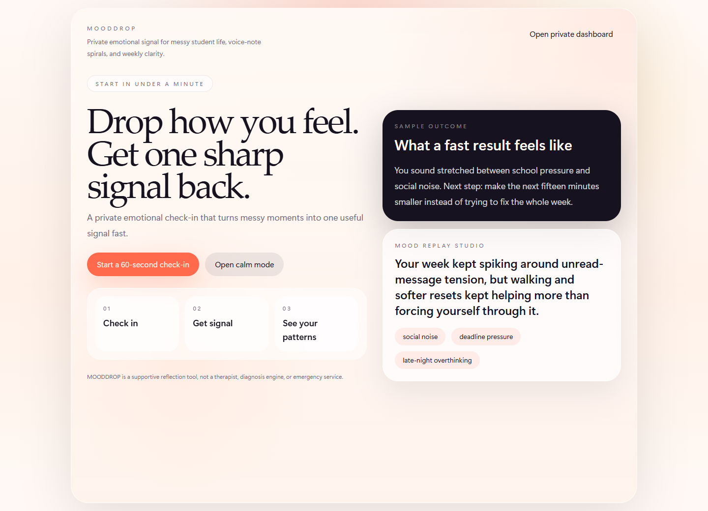
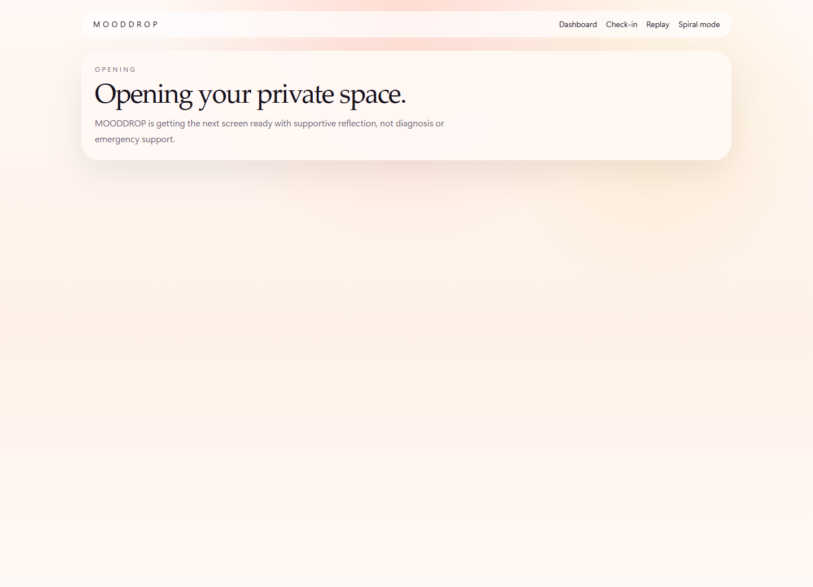
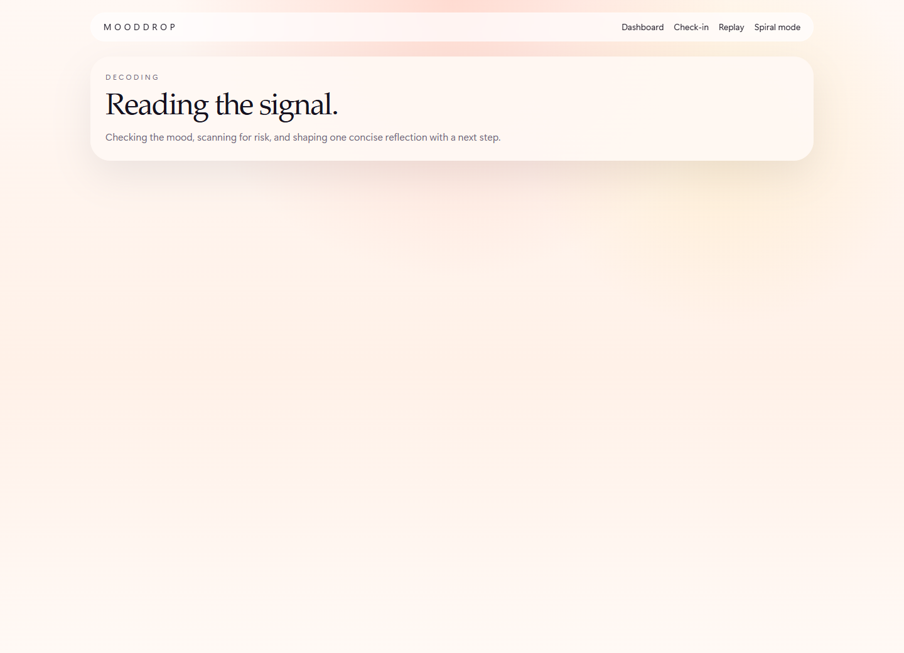
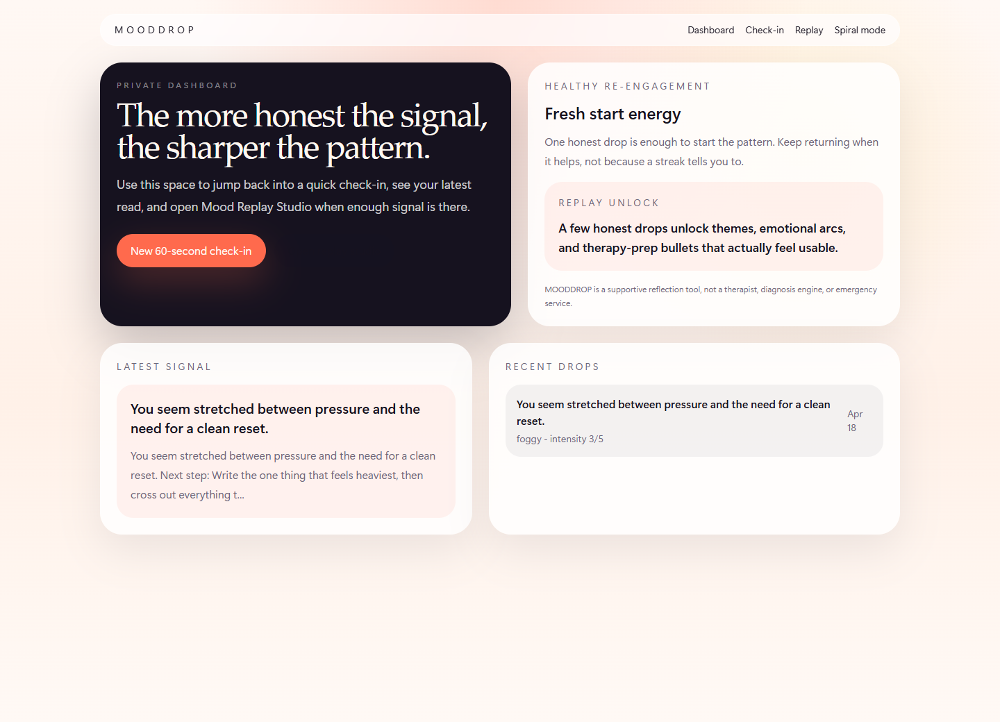
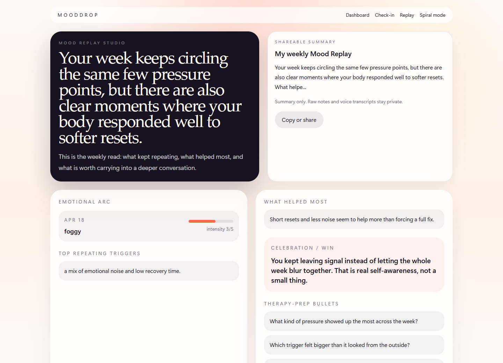

# MOODDROP

  <strong>A private emotional signal app for messy days, voice-note spirals, and clearer weekly patterns.</strong>

  
  
  
  
  

  
  

  

MOODDROP is a mobile-first emotional intelligence MVP built for a polished hackathon demo. Users can check in with mood, intensity, a short note, optional song context, and optional voice notes. The app turns that into one useful signal, a gentler next step, and a weekly replay that stays supportive without pretending to be therapy.

## Why it lands fast

- `Start a 60-second check-in` is the main path, so first use feels obvious.
- `Open calm mode` is always available when someone wants a simpler, lower-friction support screen.
- Voice notes and song context stay optional instead of slowing down the default flow.
- Weekly Mood Replay Studio turns raw drops into themes, emotional arcs, what helped, and exactly three therapy-prep bullets.

## Product flow

`Guest entry -> quick check-in -> risk gate -> insight or calm mode -> dashboard -> Mood Replay Studio`

### One drop returns

- one concise emotional read
- one likely trigger
- one micro-action
- one reflection prompt

### The weekly replay adds

- emotional arc
- top repeating triggers
- what helped most
- one celebration note
- exactly 3 therapy-prep bullets
- one privacy-safe share summary

## Screens

<table>
  <tr>
    <td width="50%">
      
    </td>
    <td width="50%">
      
    </td>
  </tr>
  <tr>
    <td width="50%">
      
    </td>
    <td width="50%">
      
    </td>
  </tr>
</table>

## Safety by design

- MOODDROP always discloses that it is a supportive reflection tool, not a therapist, diagnosis engine, or emergency service.
- Elevated-risk language routes to calm mode before normal reflective output.
- Shared output is summary-only. Raw notes and voice transcripts stay private.
- The copy layer blocks diagnosis claims, therapist claims, crisis-counseling claims, and emotionally dependent retention language.
- Healthy re-engagement is insight-driven, not streak-driven.

## Current MVP features

- Guest-session entry with secure cookie-backed private spaces
- Quick check-in with mood, intensity, optional note, optional song, and optional voice note
- Conservative risk classification before normal insight generation
- Dedicated calm mode for direct entry or elevated-risk routing
- Dashboard with recent drops, latest signal, and neutral re-engagement framing
- Mood Replay Studio with replay summary and therapy-prep bullets
- Privacy-safe share summaries for insights and replay outputs
- Typed service layer, Zod validation, Drizzle schema, and optional OpenAI + Supabase integrations

## Stack

- Next.js App Router
- TypeScript
- Tailwind CSS
- Zod
- Drizzle ORM
- Supabase-ready storage + session helpers
- OpenAI-ready generation + transcription layer
- Vitest
- Playwright for demo media capture

## Local run

1. Install dependencies: `cmd /c npm.cmd install`
2. Copy `.env.example` to `.env.local` if you want production integrations.
3. Start a live dev session with `cmd /c npm.cmd run dev`
4. For the steadiest local demo flow, use `cmd /c npm.cmd run demo`
5. Open `http://localhost:3000`

Without env vars, the app still works in demo mode using in-memory sessions, check-in storage, replay generation, and voice-note blob serving.

## Optional integrations

### Postgres + Drizzle

Set `DATABASE_URL`, then use:

- `cmd /c npm.cmd run db:generate`

### OpenAI

Set:

- `OPENAI_API_KEY`
- `OPENAI_MODEL`
- `OPENAI_AUDIO_MODEL`

If these are missing, MOODDROP falls back to deterministic local heuristics for insight, replay, and transcription handling.

### Supabase storage

Set:

- `NEXT_PUBLIC_SUPABASE_URL`
- `NEXT_PUBLIC_SUPABASE_PUBLISHABLE_KEY` or `NEXT_PUBLIC_SUPABASE_ANON_KEY`
- `SUPABASE_SECRET_KEY` or `SUPABASE_SERVICE_ROLE_KEY`
- `SUPABASE_AUDIO_BUCKET`

If these are missing, voice-note uploads stay in the in-memory demo blob store.

## Demo assets

- GitHub shows the walkthrough video as a downloadable release asset, not an inline player.
- Open the release here: [MOODDROP MVP release](https://github.com/vibhuwolf/Mental-health-experimental-app/releases/tag/v0.1.0-mvp)
- Download the video directly here: [mooddrop-testing-walkthrough.webm](https://github.com/vibhuwolf/Mental-health-experimental-app/releases/download/v0.1.0-mvp/mooddrop-testing-walkthrough.webm)
- Fresh repo screenshots can be regenerated with `cmd /c npm.cmd run capture:repo-images`
- The browser walkthrough can be regenerated with `cmd /c npm.cmd run record:walkthrough`

## Verification

- `cmd /c npm.cmd run lint`
- `cmd /c npm.cmd run typecheck`
- `cmd /c npm.cmd test`
- `cmd /c npm.cmd run build`
